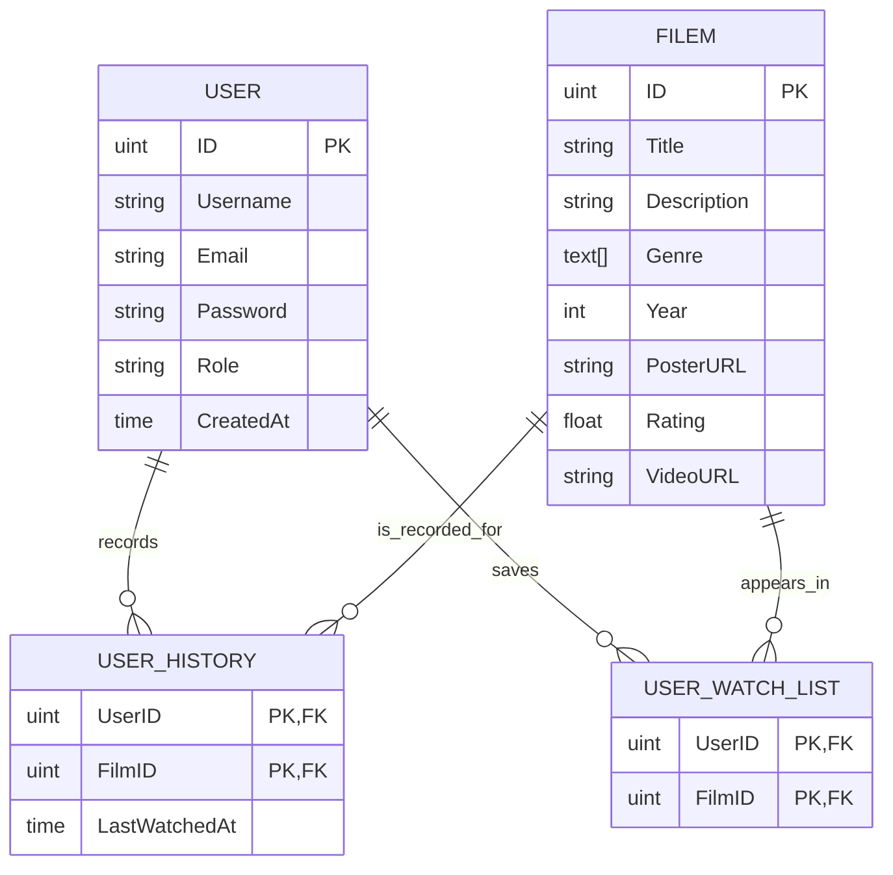
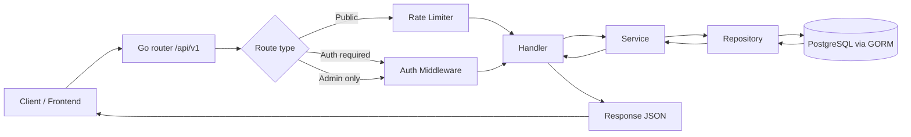

**Web Streaming (Backend)**

## Deskripsi Proyek

Ini adalah backend API untuk aplikasi web streaming film yang dibangun dengan Go dan PostgreSQL. Proyek ini menggunakan arsitektur clean architecture dengan pemisahan yang jelas antara layer handler, service, dan repository.

**Fitur Utama:**
- ✅ Autentikasi user dengan JWT (access token + refresh token)
- ✅ Sistem role-based access control (user biasa dan admin)
- ✅ Rate limiting untuk melindungi API dari abuse
- ✅ CORS (Cross-Origin Resource Sharing) support
- ✅ Database management dengan GORM ORM
- ✅ Logging terstruktur dengan Zerolog
- ✅ Input validation otomatis
- ✅ Response format yang konsisten

**Apa yang Bisa Dilakukan:**
- **User** dapat register, login, melihat daftar film, mencari film, menambah ke watchlist, melihat history menonton
- **Admin** dapat mengelola film (create, update, delete)
- Setiap action dilindungi middleware autentikasi dan rate limiter

---

**Project Structure**
- **main:** [backend/main.go](backend/main.go) — application entrypoint and server start.
- **config:** [backend/config/database.go](backend/config/database.go) — configuration helpers (database setup).
- **internal/domain:** [backend/internal/domain](backend/internal/domain) — domain models (`film.go`, `user.go`).
- **internal/handler:** [backend/internal/handler](backend/internal/handler) — HTTP handlers for routes.
- **internal/service:** [backend/internal/service](backend/internal/service) — business logic.
- **internal/repository:** [backend/internal/repository](backend/internal/repository) — data access layer.
- **pkg/middleware:** [backend/pkg/middleware](backend/pkg/middleware) — middleware utilities (auth, etc.).
- **routes:** [backend/routes/routes.go](backend/routes/routes.go) — route definitions and wiring.

**ERD Diagram**

**Flow Diagram**

