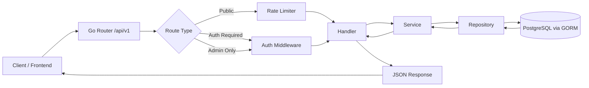
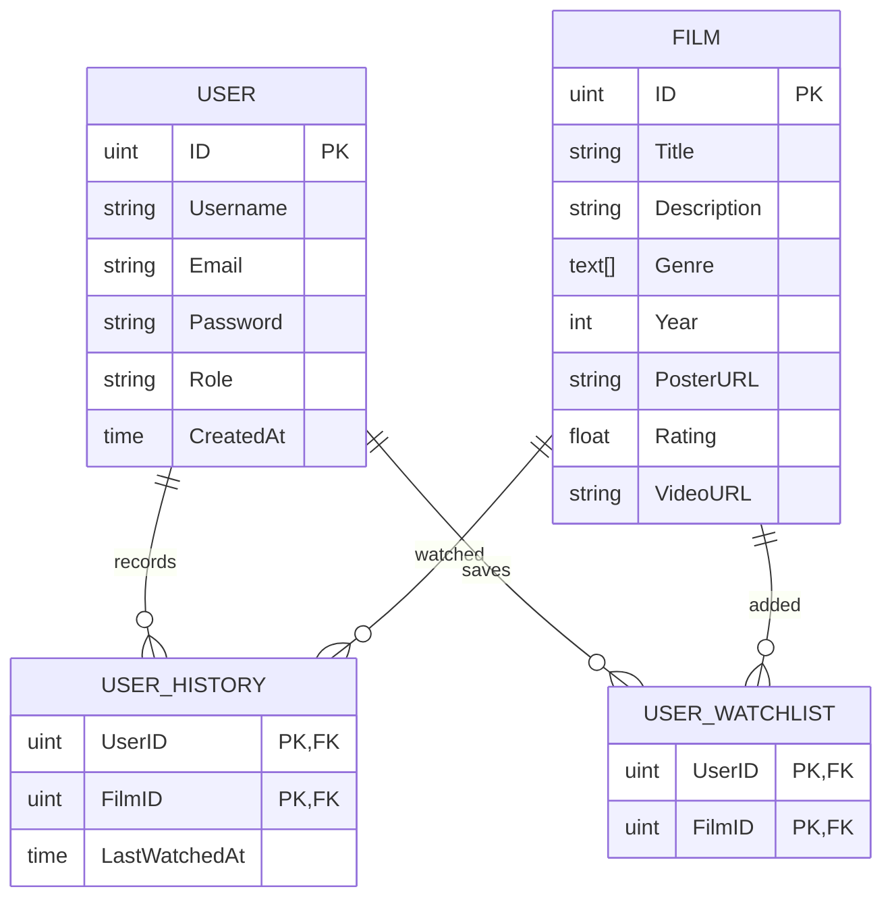

# Web Streaming (Backend)

Backend service for a movie streaming platform built with Go and PostgreSQL, designed using Clean Architecture principles with a clear separation between handler, service, and repository layers.

This project focuses on scalable backend development, authentication systems, middleware protection, and structured API design for media platform applications.

---

# Tech Stack

- Golang
- PostgreSQL
- GORM
- JWT Authentication
- Zerolog
- REST API
- Clean Architecture

---

# Core Features

## Authentication & Security

- JWT authentication (access token + refresh token)
- Role-based access control (RBAC)
- Rate limiting middleware
- CORS protection
- Protected private routes
- Input validation

## Streaming Platform Features

- User registration & login
- Movie catalog management
- Search movies
- Watchlist system
- Watch history tracking
- Admin movie management

## Backend Engineering

- Clean Architecture implementation
- Structured logging with Zerolog
- Repository pattern
- Consistent JSON response format
- PostgreSQL integration with GORM
- Middleware-based request protection

---

# Architecture

This project follows Clean Architecture principles to maintain scalability, separation of concerns, and maintainable business logic.

```text
Handler Layer
↓
Service Layer
↓
Repository Layer
↓
PostgreSQL Database
```

### Request Flow



---

# Project Structure

```text
backend/
├── main.go
├── config/
├── internal/
│   ├── domain/
│   ├── handler/
│   ├── service/
│   └── repository/
├── pkg/
│   └── middleware/
└── routes/
```

## Folder Responsibilities

| Folder | Description |
|---|---|
| `main.go` | Application entrypoint |
| `config/` | Database & app configuration |
| `internal/domain` | Domain models |
| `internal/handler` | HTTP handlers |
| `internal/service` | Business logic |
| `internal/repository` | Database access layer |
| `pkg/middleware` | Authentication & middleware |
| `routes/` | Route registration |

---

# Database Design

## ERD Diagram



---

# API Features

## User Features

- Register & login
- Browse movies
- Search movies
- Add movies to watchlist
- Track watch history

## Admin Features

- Create movies
- Update movie data
- Delete movies
- Manage platform content

---

# Learning Goals

This project was built to explore:

- scalable backend architecture
- authentication & authorization systems
- middleware handling in Go
- repository pattern implementation
- structured logging
- REST API best practices
- PostgreSQL relationship management

---

# Future Improvements

- Docker support
- Swagger/OpenAPI documentation
- Redis caching
- Unit & integration testing
- CI/CD pipeline
- Streaming optimization
- File storage abstraction

---

# Disclaimer

This project is intended for backend engineering learning and architecture exploration purposes.
