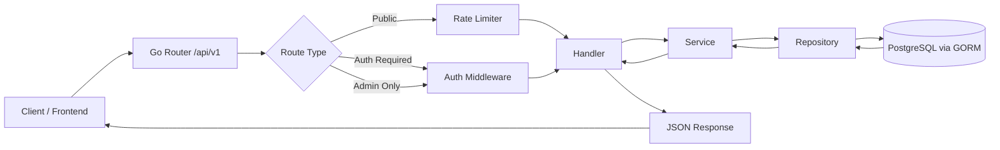
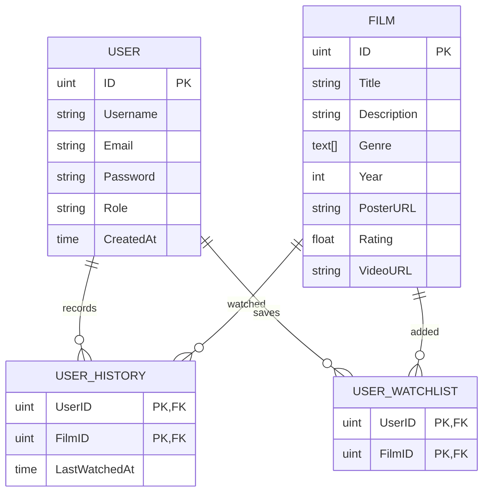

# Web Streaming (Backend)

Backend service for a movie streaming platform built with Go and PostgreSQL, designed using Clean Architecture principles with a clear separation between handler, service, and repository layers.

This project focuses on scalable backend development, authentication systems, middleware protection, and structured API design for media platform applications.

---

# Tech Stack

- Go (module: `backend`, go 1.25)
- Gin (github.com/gin-gonic/gin)
- GORM with Postgres driver (gorm.io/gorm, gorm.io/driver/postgres)
- PostgreSQL (github.com/lib/pq)
- JWT (github.com/golang-jwt/jwt)
- Zerolog (github.com/rs/zerolog)
- Rate limiter (github.com/ulule/limiter)
- UUID (github.com/google/uuid)
- dotenv (github.com/joho/godotenv)
- REST API, Clean Architecture

---

# Core Features

## Authentication & Security

- JWT authentication (access token + refresh token)
- Role-based access control (RBAC)
- Rate limiting middleware
- CORS protection
- Protected private routes
- Input validation

## Streaming Platform Features

- User registration & login
- Movie catalog management
- Search movies
- Watchlist system
- Watch history tracking
- Admin movie management

## Backend Engineering

- Clean Architecture implementation
- Structured logging with Zerolog
- Repository pattern
- Consistent JSON response format
- PostgreSQL integration with GORM
- Middleware-based request protection

---

# Architecture

This project follows Clean Architecture principles to maintain scalability, separation of concerns, and maintainable business logic.

```text
Handler Layer
↓
Service Layer
↓
Repository Layer
↓
PostgreSQL Database
```

### Request Flow



---

# Project Structure

File and folder layout (actual contents of `backend/`):

```text
backend/
├── .env.example
├── .gitignore
├── go.mod
├── go.sum
├── main.go
├── config/
│   └── database.go
├── internal/
│   ├── domain/
│   │   ├── film.go
│   │   └── user.go
	│   ├── handler/
	│   │   ├── film_handler.go
	│   │   ├── user_handler.go
	│   │   ├── watched_handler.go
	│   │   └── watchlist_handler.go
	│   ├── repository/
	│   │   ├── film_repository.go
	│   │   ├── refresh_token_repository.go
	│   │   ├── user_repository.go
	│   │   ├── watched_repository.go
	│   │   └── watchlist_repository.go
	│   └── service/
	│       ├── film_service.go
	│       ├── user_service.go
	│       ├── watched_service.go
	│       └── watchlist_service.go
├── pkg/
│   ├── adminOnly.go
│   ├── logger/
│   │   └── logger.go
│   ├── middleware/
│   │   ├── auth.middleware.go
	│   │   └── rate_limiter.go
│   └── response/
│       └── response.go
└── routes/
	 └── routes.go
```

## Folder Responsibilities

| Folder | Description |
|---|---|
| `main.go` | Application entrypoint |
| `config/` | Database & app configuration (database connection) |
| `internal/domain` | Domain models (`film.go`, `user.go`) |
| `internal/handler` | HTTP handlers (user, film, watched, watchlist) |
| `internal/service` | Business logic / use-cases |
| `internal/repository` | Database access layer (users, films, refresh tokens, watchlist, history) |
| `pkg/adminOnly.go` | Admin-only helper / middleware |
| `pkg/logger` | Structured logging (Zerolog) |
| `pkg/middleware` | Authentication & rate limiting middleware |
| `pkg/response` | Standard JSON response helpers |
| `routes/` | Route registration |

---

# Quick Start

Prerequisites:

- Go 1.25 or newer installed
- PostgreSQL database
- Copy and edit environment file from `.env.example`

Run locally:

```bash
cp backend/.env.example backend/.env
cd backend
go mod download
# Run directly
go run main.go
## or build and run executable
go build -o web-streaming-backend .
./web-streaming-backend
```

Environment notes:

- Edit `backend/.env` to configure database URL, JWT secrets, and other settings.
- The server exposes routes under `/api/v1`.

# API Endpoint Preview

Public endpoints:

- `POST /api/v1/register` — Register a new user (rate limit: 5/min)
- `POST /api/v1/login` — Login and receive access + refresh tokens (rate limit: 10/min)
- `GET /api/v1/films` — List films (supports pagination query `page` and `limit`)
- `GET /api/v1/films/search?title=...` — Search films by title

Authenticated endpoints (require valid access token):

- `GET /api/v1/watchlist` — Get current user's watchlist
- `POST /api/v1/watchlist` — Add a film to watchlist (rate limit: 5/min)
- `DELETE /api/v1/watchlist/:id` — Remove a film from watchlist (rate limit: 3/min)
- `GET /api/v1/history` — Get user's watch history
- `DELETE /api/v1/history/:id` — Delete one history entry (rate limit: 3/min)
- `DELETE /api/v1/history` — Delete all history (rate limit: 3/min)

Admin endpoints (require auth + admin role):

- `POST /api/v1/films` — Create a new film (rate limit: 5/min)
- `PUT /api/v1/films/:id` — Update a film (rate limit: 3/min)
- `DELETE /api/v1/films/:id` — Delete a film (rate limit: 3/min)

# Example Response

The project uses a consistent response wrapper `{ "data": ..., "error": ... }` located in `pkg/response/response.go`.

Login success (HTTP 200):

```json
{
	"data": {
		"access_token": "eyJhbGciOiJIUzI1NiIsInR5cCI6...",
		"refresh_token": "dGhpcy1pcz1hLXJlZnJlc2gtdG9rZW4..."
	},
	"error": null
}
```

Get films success (HTTP 200) — paginated response inside `data.films`:

```json
{
	"data": {
		"films": {
			"films": [
				{
					"ID": 1,
					"Title": "Example Movie",
					"Description": "A sample description",
					"Genre": ["Drama","Thriller"],
					"Year": 2024,
					"PosterURL": "https://example.com/poster.jpg",
					"Rating": 8.7,
					"VideoURL": "https://cdn.example.com/video.mp4"
				}
			],
			"total": 1,
			"page": 1,
			"limit": 10
		}
	},
	"error": null
}
```


# Database Design

## ERD Diagram



---

# API Features

## User Features

- Register & login
- Browse movies
- Search movies
- Add movies to watchlist
- Track watch history

## Admin Features

- Create movies
- Update movie data
- Delete movies
- Manage platform content

---

# Learning Goals

This project was built to explore:

- scalable backend architecture
- authentication & authorization systems
- middleware handling in Go
- repository pattern implementation
- structured logging
- REST API best practices
- PostgreSQL relationship management

---

# Future Improvements

- Docker support
- Swagger/OpenAPI documentation
- Redis caching
- Unit & integration testing
- CI/CD pipeline
- Streaming optimization
- File storage abstraction

---

# Disclaimer

This project is intended for backend engineering learning and architecture exploration purposes.
