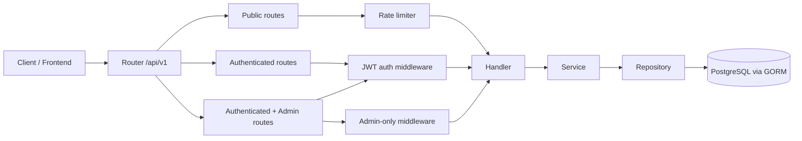

# Web Streaming Backend
Backend API for a movie streaming platform built with Go, Gin, GORM, and PostgreSQL. The codebase is organized with a clean handler/service/repository split and includes JWT authentication, refresh tokens, rate limiting, and admin-only film management.

## Tech Stack

- Go 1.25.0
- Gin v1.12.0
- GORM v1.31.1 with PostgreSQL driver v1.6.0
- PostgreSQL with `lib/pq`
- JWT auth with `golang-jwt/jwt`
- Zerolog for structured logging
- `ulule/limiter` for rate limiting
- `godotenv` for local environment loading
- `bcrypt` for password hashing

## What It Does

- User registration, login, refresh token exchange, and logout
- Public film catalog listing and title search
- Admin-only film create, update, and delete operations
- User watchlist management
- User watch history retrieval and deletion
- Standard JSON responses and centralized middleware protection

## Request Flow



## Project Structure

```text
backend/
├── .env.example
├── go.mod
├── go.sum
├── main.go
├── config/
│   └── database.go
├── internal/
│   ├── domain/
│   │   ├── film.go
│   │   └── user.go
│   ├── handler/
│   │   ├── film_handler.go
│   │   ├── user_handler.go
│   │   ├── watched_handler.go
│   │   └── watchlist_handler.go
│   ├── repository/
│   │   ├── film_repository.go
│   │   ├── refresh_token_repository.go
│   │   ├── user_repository.go
│   │   ├── watched_repository.go
│   │   └── watchlist_repository.go
│   └── service/
│       ├── film_service.go
│       ├── user_service.go
│       ├── watched_service.go
│       └── watchlist_service.go
├── pkg/
│   ├── adminOnly.go
│   ├── logger/
│   │   └── logger.go
│   ├── middleware/
│   │   ├── auth.middleware.go
│   │   └── rate_limiter.go
│   └── response/
│       └── response.go
└── routes/
    └── routes.go
```

## Main Components

### Domain

- `internal/domain/film.go` defines the film model, pagination types, watchlist/history models, and repository/service interfaces.
- `internal/domain/user.go` defines the user model, registration/login inputs, refresh token model, and user auth interfaces.

### Handlers

- `user_handler.go` handles `/register`, `/login`, `/refresh-token`, and `/logout`.
- `film_handler.go` handles `/films`, `/films/search`, and admin film CRUD.
- `watchlist_handler.go` handles watchlist add/remove/list actions.
- `watched_handler.go` handles watch history list/delete actions.

### Middleware and Shared Utilities

- `pkg/middleware/auth.middleware.go` validates the bearer token and stores `user_id`, `username`, and `role` in request context.
- `pkg/adminOnly.go` blocks non-admin users from film write operations.
- `pkg/middleware/rate_limiter.go` applies per-route rate limits.
- `pkg/response/response.go` standardizes JSON responses as `{ data, error }`.
- `pkg/logger/logger.go` sets up Zerolog output to stdout.

## API Routes

All routes are mounted under `/api/v1`.

### Public Routes

- `POST /register` - create a new user account
- `POST /login` - exchange email/password for access and refresh tokens
- `POST /refresh-token` - exchange a refresh token for a new access token
- `GET /films` - list films with pagination via `page` and `limit`
- `GET /films/search?title=...` - search films by title

### Authenticated Routes

- `GET /watchlist` - fetch the current user's watchlist
- `POST /watchlist` - add a film to the watchlist
- `DELETE /watchlist/:id` - remove a film from the watchlist
- `GET /history` - fetch the current user's watch history
- `DELETE /history/:id` - remove one history entry
- `DELETE /history` - clear the full history
- `POST /logout` - revoke the current user's refresh tokens

### Admin-Only Routes

- `POST /films` - create a film
- `PUT /films/:id` - update a film
- `DELETE /films/:id` - delete a film

## Environment Variables

Copy `backend/.env.example` to `backend/.env` and fill in these values:

- `DB_HOST`
- `DB_PORT`
- `DB_USER`
- `DB_PASSWORD`
- `DB_NAME`
- `DB_SSLMODE`
- `ALLOWED_ORIGINS`
- `JWT_SECRET`
- `REFRESH_TOKEN_SECRET`
- `ACCESS_TOKEN_DURATION`
- `REFRESH_TOKEN_DURATION`

## Run Locally

From the `backend/` directory:

```bash
go mod download
go run main.go
```

The server listens on port `1010` and loads environment values from `.env` at startup.

## Notes

- The database connection runs AutoMigrate on startup for the user, film, watchlist, history, and refresh-token tables.
- CORS headers are set in `main.go` using the `ALLOWED_ORIGINS` environment variable.
- Access tokens are signed with `JWT_SECRET`, while refreshed access tokens use `REFRESH_TOKEN_SECRET`.
# Test connection
psql -h localhost -U postgres -d web_streaming
```

### JWT Token Expired

**Error:** `invalid refresh token`

**Solution:**
- Use the `/refresh-token` endpoint with valid refresh token
- Check `ACCESS_TOKEN_DURATION` and `REFRESH_TOKEN_DURATION` in `.env`

### Rate Limit Exceeded

**Error:** `429 Too Many Requests`

**Solution:**
- Wait before retrying the endpoint
- Adjust rate limit in `routes.go` if needed (for development)
- Implement exponential backoff in client

### Port Already in Use

**Error:** `listen tcp :8080: bind: address already in use`

**Solution:**
- Change `PORT` in `.env`
- Or kill existing process: `lsof -ti:8080 | xargs kill -9`

### Admin Endpoint Access Denied

**Error:** `unauthorized access`

**Solution:**
- Verify user role is `admin` in database
- Check token is valid and not expired
- Test with SQL: `SELECT role FROM users WHERE id = <user_id>;`

---

# Performance Optimization Tips

## Caching Strategies (Future)

- **Film List:** Cache paginated film results (1-5 min TTL)
- **Search Results:** Cache search queries (2-5 min TTL)
- **User Sessions:** Use Redis for refresh tokens (auto-expire)

## Database Optimization

- Add indexes on frequently queried columns (email, username, title)
- Use database connection pooling (GORM handles this)
- Monitor slow queries with query logging

## API Response Optimization

- Implement field selection (GraphQL-style filtering)
- Compress responses (gzip middleware)
- Limit watchlist/history results with pagination

---

# Production Checklist

- [ ] Set `GIN_MODE=release` in `.env`
- [ ] Use strong, random `JWT_SECRET` and `REFRESH_TOKEN_SECRET`
- [ ] Enable HTTPS/TLS
- [ ] Configure CORS properly (whitelist specific origins)
- [ ] Set up database backups
- [ ] Enable structured logging and monitoring
- [ ] Implement health check endpoint (`GET /health`)
- [ ] Set up rate limiting based on production load
- [ ] Use environment-specific `.env` files (dev, staging, prod)
- [ ] Test all endpoints with production data

---

# Learning Goals

This project was built to explore and demonstrate:

- **Scalable Backend Architecture** — Clean Architecture separation of concerns (handler → service → repository)
- **Authentication & Authorization** — JWT token-based auth with refresh tokens and role-based access control
- **Middleware Handling** — Rate limiting, auth validation, and request preprocessing in Go
- **Repository Pattern** — Data abstraction layer with GORM for database operations
- **Structured Logging** — Zerolog implementation for production-grade logging
- **REST API Best Practices** — Consistent response format, proper HTTP status codes, error handling
- **PostgreSQL Relationship Management** — Many-to-many relationships, foreign keys, cascading deletes
- **Go Concurrency & Performance** — Goroutines, efficient request handling with Gin
- **Middleware Chain Architecture** — Route grouping and middleware composition

---

# Testing the API

## Using cURL

```bash
# Register
curl -X POST http://localhost:8080/api/v1/register \
  -H "Content-Type: application/json" \
  -d '{"username":"john","email":"john@example.com","password":"pass123"}'

# Login
curl -X POST http://localhost:8080/api/v1/login \
  -H "Content-Type: application/json" \
  -d '{"email":"john@example.com","password":"pass123"}'

# Get Films (with token)
curl -X GET http://localhost:8080/api/v1/films \
  -H "Authorization: Bearer <token>"
```

## Using Postman

1. Import the API endpoints into Postman
2. Set `Authorization` header to `Bearer <access_token>`
3. Use environment variables for `{{BASE_URL}}`, `{{TOKEN}}`, etc.
4. Create collections for different user types (public, authenticated, admin)

## Using REST Client (VS Code)

Create `.http` files for testing:

```http
@baseUrl = http://localhost:8080

### Register User
POST {{baseUrl}}/api/v1/register
Content-Type: application/json

{
  "username": "testuser",
  "email": "test@example.com",
  "password": "password123"
}

### Login
POST {{baseUrl}}/api/v1/login
Content-Type: application/json

{
  "email": "test@example.com",
  "password": "password123"
}

### Get Films (authenticated)
GET {{baseUrl}}/api/v1/films
Authorization: Bearer <token>
```

---

# Future Improvements

- **Docker Support** — Containerize app and database for easy deployment
- **Swagger/OpenAPI Documentation** — Auto-generated API docs with interactive UI
- **Redis Caching** — Cache frequently accessed data (films, watchlists)
- **Unit & Integration Testing** — Comprehensive test coverage for services/repositories
- **CI/CD Pipeline** — GitHub Actions for automated testing and deployment
- **WebSocket Support** — Real-time notifications for watch history updates
- **File Upload Service** — Poster and video file management
- **Analytics** — Track viewing patterns, popular films, user engagement
- **Recommendation Engine** — Suggest films based on watch history
- **Advanced Search** — Filter by genre, rating, year, etc.
- **Comments & Ratings** — User reviews and film ratings
- **Pagination Cursor** — Use cursor-based pagination for better performance
- **GraphQL Option** — Alternative to REST API
- **Message Queue** — Async processing with RabbitMQ/Kafka

---

# API Testing Tools Recommendations

| Tool | Purpose | Use Case |
|---|---|---|
| [Postman](https://www.postman.com/) | API testing & documentation | Comprehensive testing, collaboration |
| [Insomnia](https://insomnia.rest/) | REST/GraphQL client | Lightweight alternative to Postman |
| [curl](https://curl.se/) | Command-line HTTP client | Quick testing, CI/CD integration |
| [REST Client (VS Code)](https://marketplace.visualstudio.com/items?itemName=humao.rest-client) | IDE extension | Integrated development testing |
| [Thunder Client](https://www.thunderclient.com/) | VS Code extension | Fast API testing in editor |
| [Apache JMeter](https://jmeter.apache.org/) | Load testing | Performance and stress testing |
| [k6](https://k6.io/) | Performance testing | Cloud-based load testing |

---

# Contributing

To extend this project:

1. Fork and create a feature branch
2. Follow the Clean Architecture pattern (handler → service → repository)
3. Add tests for new business logic
4. Ensure consistent error handling with response wrapper
5. Update documentation for new endpoints
6. Submit PR with detailed description

---

# Disclaimer

This project is intended for **backend engineering learning and architecture exploration purposes**. It demonstrates best practices and patterns for building scalable Go APIs, but may not include all enterprise-grade production features.

**Not recommended for direct production use without:**
- Additional security hardening
- Performance optimization and caching
- Comprehensive testing
- Monitoring and alerting setup
- Database migration management
- API versioning strategy
