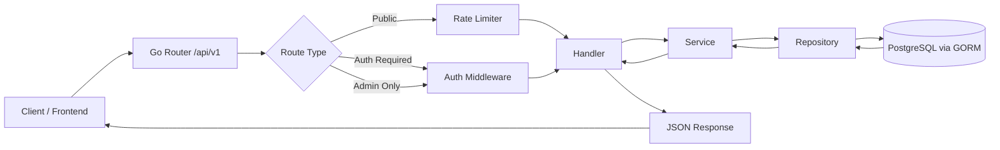
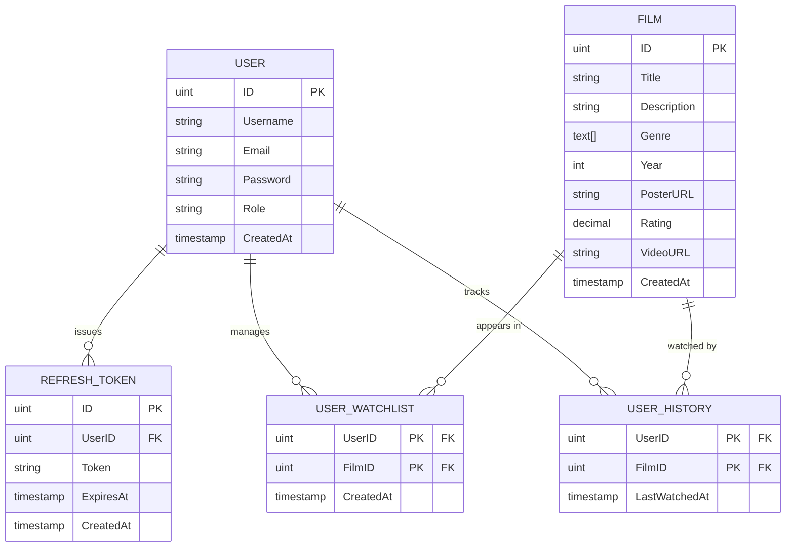

# Web Streaming (Backend)

Backend service for a movie streaming platform built with Go and PostgreSQL, designed using Clean Architecture principles with a clear separation between handler, service, and repository layers.

This project focuses on scalable backend development, authentication systems, middleware protection, and structured API design for media platform applications.

---

# Tech Stack

- Go (module: `backend`, go 1.25.0)
- Gin (github.com/gin-gonic/gin v1.12.0)
- GORM with Postgres driver (gorm.io/gorm v1.31.1, gorm.io/driver/postgres v1.6.0)
- PostgreSQL (github.com/lib/pq v1.12.3)
- JWT (github.com/golang-jwt/jwt v3.2.2)
- Zerolog (github.com/rs/zerolog v1.35.1)
- Rate limiter (github.com/ulule/limiter/v3 v3.11.2)
- UUID (github.com/google/uuid v1.6.0)
- dotenv (github.com/joho/godotenv v1.5.1)
- Crypto (golang.org/x/crypto v0.50.0)
- REST API, Clean Architecture

---

# Core Features

## Authentication & Security

- JWT authentication (access token + refresh token)
- Role-based access control (RBAC)
- Rate limiting middleware
- CORS protection
- Protected private routes
- Input validation

## Streaming Platform Features

- User registration & login
- Movie catalog management
- Search movies
- Watchlist system
- Watch history tracking
- Admin movie management

## Backend Engineering

- Clean Architecture implementation
- Structured logging with Zerolog
- Repository pattern
- Consistent JSON response format
- PostgreSQL integration with GORM
- Middleware-based request protection

---

# Architecture

This project follows Clean Architecture principles to maintain scalability, separation of concerns, and maintainable business logic.

```text
Handler Layer
↓
Service Layer
↓
Repository Layer
↓
PostgreSQL Database
```

### Request Flow



---

# Project Structure

File and folder layout (actual contents of `backend/`):

```text
backend/
├── .env
├── .env.example
├── .gitignore
├── go.mod
├── go.sum
├── main.go
├── config/
│   └── database.go
├── internal/
│   ├── domain/
│   │   ├── film.go
│   │   └── user.go
│   ├── handler/
│   │   ├── film_handler.go
│   │   ├── user_handler.go
│   │   ├── watched_handler.go
│   │   └── watchlist_handler.go
│   ├── repository/
│   │   ├── film_repository.go
│   │   ├── refresh_token_repository.go
│   │   ├── user_repository.go
│   │   ├── watched_repository.go
│   │   └── watchlist_repository.go
│   └── service/
│       ├── film_service.go
│       ├── user_service.go
│       ├── watched_service.go
│       └── watchlist_service.go
├── pkg/
│   ├── adminOnly.go
│   ├── logger/
│   │   └── logger.go
│   ├── middleware/
│   │   ├── auth.middleware.go
│   │   └── rate_limiter.go
│   └── response/
│       └── response.go
└── routes/
    └── routes.go
```

## Layer Breakdown

### Domain Layer (`internal/domain/`)

Core business entities and interfaces defining the application's data models and contracts:

| File | Description |
|---|---|
| `film.go` | Film model, Film service interface, pagination models |
| `user.go` | User model, auth models (LoginInput, RegisterInput), User service interface |

### Handler Layer (`internal/handler/`)

HTTP request handlers that receive requests, validate input, call services, and return responses:

| Handler | Endpoints | Description |
|---|---|---|
| `user_handler.go` | `/register`, `/login`, `/refresh-token` | User authentication (registration, login, token refresh) |
| `film_handler.go` | `/films`, `/films/search`, `/films/:id` (admin) | Film listing, search, and admin CRUD operations |
| `watchlist_handler.go` | `/watchlist`, `/watchlist/:id` | User watchlist management (add, remove, get) |
| `watched_handler.go` | `/history`, `/history/:id` | Watch history tracking (get, delete single, delete all) |

### Service Layer (`internal/service/`)

Business logic implementation containing use-case logic and data processing:

| Service | Description |
|---|---|
| `user_service.go` | User registration, login, JWT token generation and validation, refresh token logic |
| `film_service.go` | Film retrieval, pagination, search functionality |
| `watchlist_service.go` | Add/remove films to/from watchlist, retrieve watchlist |
| `watched_service.go` | Track watch history, retrieve history, delete history entries |

### Repository Layer (`internal/repository/`)

Database access layer implementing data persistence with GORM:

| Repository | Description |
|---|---|
| `user_repository.go` | CRUD operations for users (create, read, update) |
| `film_repository.go` | CRUD operations for films with pagination and search |
| `watchlist_repository.go` | Store and manage user watchlist entries |
| `watched_repository.go` | Store and manage user watch history |
| `refresh_token_repository.go` | Manage JWT refresh tokens |

### Package Layer (`pkg/`)

Utility packages and shared middleware:

| File | Description |
|---|---|
| `response/response.go` | Standardized JSON response wrapper (`{ data, error }`) for all endpoints |
| `logger/logger.go` | Zerolog-based structured logging configuration |
| `middleware/auth.middleware.go` | JWT authentication middleware for protected routes |
| `middleware/rate_limiter.go` | Rate limiting middleware using ulule/limiter |
| `adminOnly.go` | Middleware enforcing admin-only access control |

### Configuration & Routing

| File | Description |
|---|---|
| `main.go` | Application entry point, server initialization |
| `config/database.go` | PostgreSQL database connection setup with GORM |
| `routes/routes.go` | Route registration and middleware chain setup |

---

# Quick Start

Prerequisites:

- Go 1.25 or newer installed
- PostgreSQL database
- Copy and edit environment file from `.env.example`

Run locally:

```bash
cp backend/.env.example backend/.env
cd backend
go mod download
# Run directly
go run main.go
## or build and run executable
go build -o web-streaming-backend .
./web-streaming-backend
```

# Middleware & Security

## Authentication Middleware (`pkg/middleware/auth.middleware.go`)

Validates JWT access tokens on protected routes. Extracts and injects `user_id` into request context for downstream handlers.

- **Location:** Protected routes in `/api/v1` (authenticated group)
- **Token Header:** `Authorization: Bearer <access_token>`
- **Token Type:** JWT (HS256)
- **Claims:** User ID and role information
- **Error:** Returns `401 Unauthorized` if token is missing, invalid, or expired

## Rate Limiting Middleware (`pkg/middleware/rate_limiter.go`)

Prevents abuse by limiting request frequency per IP address or user. Configured as `"<count>-<period>"` (e.g., `"5-M"` = 5 requests per minute).

- **Public Endpoints:** Rate limits apply globally per IP
- **Authenticated Endpoints:** Rate limits apply per user
- **Admin Endpoints:** Rate limits apply per admin user
- **Error:** Returns `429 Too Many Requests` when limit exceeded

## Admin-Only Middleware (`pkg/adminOnly.go`)

Enforces role-based access control on admin endpoints. Checks user role from JWT claims.

- **Required Role:** `"admin"`
- **Applied On:** Film creation, updates, and deletion endpoints
- **Error:** Returns `403 Forbidden` if user is not admin

---

# Environment Configuration

## Required Environment Variables

Create a `backend/.env` file based on `.env.example` with:

```env
# Database
DB_HOST=localhost
DB_PORT=5432
DB_USER=postgres
DB_PASSWORD=your_password
DB_NAME=web_streaming

# JWT
JWT_SECRET=your_secret_key_here
REFRESH_TOKEN_SECRET=your_refresh_secret_here
ACCESS_TOKEN_DURATION=15m
REFRESH_TOKEN_DURATION=7d

# Server
PORT=8080
GIN_MODE=release  # or "debug" for development

# CORS (optional)
CORS_ALLOWED_ORIGINS=http://localhost:3000,http://localhost:3001
```

## Starting the Application

```bash
cd backend

# Set environment variables
export GIN_MODE=debug  # or set in .env

# Run
go run main.go

# Output:
# [GIN-debug] Listening and serving HTTP on :8080
```

---

# Query Parameters

## Films Pagination

| Parameter | Type | Default | Max | Description |
|-----------|------|---------|-----|-------------|
| `page` | int | 1 | - | Page number (1-indexed) |
| `limit` | int | 10 | 20 | Films per page |

**Example:**
```
GET /api/v1/films?page=2&limit=15
```

## Films Search

| Parameter | Type | Required | Description |
|-----------|------|----------|-------------|
| `title` | string | yes | Film title to search (partial matching) |

**Example:**
```
GET /api/v1/films/search?title=Inception
```

---

## Authentication

All authenticated endpoints require a valid JWT access token in the `Authorization` header:

```
Authorization: Bearer <access_token>
```

Tokens are obtained from `/login` and can be refreshed using `/refresh-token`.

## Public Endpoints

| Method | Endpoint | Description | Rate Limit |
|--------|----------|-------------|------------|
| `POST` | `/api/v1/register` | Register new user | 5/min |
| `POST` | `/api/v1/login` | Login user, receive tokens | 10/min |
| `POST` | `/api/v1/refresh-token` | Refresh access token | 10/min |
| `GET` | `/api/v1/films` | Get paginated film list | - |
| `GET` | `/api/v1/films/search?title=...` | Search films by title | - |

## Authenticated Endpoints

Require valid JWT access token. Rate limited per user.

| Method | Endpoint | Description | Rate Limit |
|--------|----------|-------------|------------|
| `GET` | `/api/v1/watchlist` | Get user's watchlist | - |
| `POST` | `/api/v1/watchlist` | Add film to watchlist | 5/min |
| `DELETE` | `/api/v1/watchlist/:id` | Remove film from watchlist | 3/min |
| `GET` | `/api/v1/history` | Get user's watch history | - |
| `DELETE` | `/api/v1/history/:id` | Delete specific history entry | 3/min |
| `DELETE` | `/api/v1/history` | Delete all user history | 3/min |

## Admin Endpoints

Require valid JWT access token **AND** admin role. Enforced by `adminOnly` middleware.

| Method | Endpoint | Description | Rate Limit |
|--------|----------|-------------|------------|
| `POST` | `/api/v1/films` | Create new film | 5/min |
| `PUT` | `/api/v1/films/:id` | Update existing film | 3/min |
| `DELETE` | `/api/v1/films/:id` | Delete film | 3/min |

# Example Requests & Responses

The project uses a consistent response wrapper `{ "data": ..., "error": ... }` located in `pkg/response/response.go`.

## Register User

**Request:**
```bash
POST /api/v1/register
Content-Type: application/json

{
  "username": "john_doe",
  "email": "john@example.com",
  "password": "securepassword123"
}
```

**Response (201 Created):**
```json
{
  "data": {
    "message": "Berhasil Register!"
  },
  "error": null
}
```

## Login User

**Request:**
```bash
POST /api/v1/login
Content-Type: application/json

{
  "email": "john@example.com",
  "password": "securepassword123"
}
```

**Response (200 OK):**
```json
{
  "data": {
    "access_token": "eyJhbGciOiJIUzI1NiIsInR5cCI6IkpXVCJ9...",
    "refresh_token": "eyJhbGciOiJIUzI1NiIsInR5cCI6IkpXVCJ9..."
  },
  "error": null
}
```

## Refresh Access Token

**Request:**
```bash
POST /api/v1/refresh-token
Content-Type: application/json

{
  "refresh_token": "eyJhbGciOiJIUzI1NiIsInR5cCI6IkpXVCJ9..."
}
```

**Response (200 OK):**
```json
{
  "data": {
    "access_token": "eyJhbGciOiJIUzI1NiIsInR5cCI6IkpXVCJ9..."
  },
  "error": null
}
```

## Get Films (Paginated)

**Request:**
```bash
GET /api/v1/films?page=1&limit=10
```

**Response (200 OK):**
```json
{
  "data": {
    "films": [
      {
        "ID": 1,
        "Title": "Inception",
        "Description": "A skilled thief who steals corporate secrets...",
        "Genre": ["Sci-Fi", "Thriller"],
        "Year": 2010,
        "PosterURL": "https://cdn.example.com/inception.jpg",
        "Rating": 8.8,
        "VideoURL": "https://cdn.example.com/inception.mp4"
      }
    ],
    "total": 150,
    "page": 1,
    "limit": 10
  },
  "error": null
}
```

## Search Films

**Request:**
```bash
GET /api/v1/films/search?title=Inception
```

**Response (200 OK):**
```json
{
  "data": {
    "films": [
      {
        "ID": 1,
        "Title": "Inception",
        "Description": "A skilled thief who steals corporate secrets...",
        "Genre": ["Sci-Fi", "Thriller"],
        "Year": 2010,
        "PosterURL": "https://cdn.example.com/inception.jpg",
        "Rating": 8.8,
        "VideoURL": "https://cdn.example.com/inception.mp4"
      }
    ]
  },
  "error": null
}
```

## Add to Watchlist (Authenticated)

**Request:**
```bash
POST /api/v1/watchlist
Authorization: Bearer <access_token>
Content-Type: application/json

{
  "film_id": 1
}
```

**Response (200 OK):**
```json
{
  "data": "film successfully added to watchlist",
  "error": null
}
```

## Get User Watchlist (Authenticated)

**Request:**
```bash
GET /api/v1/watchlist
Authorization: Bearer <access_token>
```

**Response (200 OK):**
```json
{
  "data": {
    "watchlist": [
      {
        "ID": 1,
        "Title": "Inception",
        "Description": "A skilled thief...",
        "Genre": ["Sci-Fi", "Thriller"],
        "Year": 2010,
        "PosterURL": "https://cdn.example.com/inception.jpg",
        "Rating": 8.8,
        "VideoURL": "https://cdn.example.com/inception.mp4"
      }
    ]
  },
  "error": null
}
```

## Get Watch History (Authenticated)

**Request:**
```bash
GET /api/v1/history
Authorization: Bearer <access_token>
```

**Response (200 OK):**
```json
{
  "data": {
    "history": [
      {
        "FilmID": 1,
        "UserID": 5,
        "LastWatchedAt": "2026-05-09T14:30:00Z"
      }
    ]
  },
  "error": null
}
```

## Error Response

**Example (401 Unauthorized):**
```json
{
  "data": null,
  "error": "Wrong email or password, please try again"
}
```

**Example (403 Forbidden - Admin Only):**
```json
{
  "data": null,
  "error": "unauthorized access"
}
```


# Database Design

## Database Schema

### USER Table

Stores user account information with role-based access control.

```sql
CREATE TABLE users (
  id SERIAL PRIMARY KEY,
  username VARCHAR(255) UNIQUE NOT NULL,
  email VARCHAR(255) UNIQUE NOT NULL,
  password VARCHAR(255) NOT NULL,
  role VARCHAR(50) DEFAULT 'user',  -- 'user' or 'admin'
  created_at TIMESTAMP DEFAULT CURRENT_TIMESTAMP
);
```

### FILM Table

Stores film/movie metadata.

```sql
CREATE TABLE films (
  id SERIAL PRIMARY KEY,
  title VARCHAR(255) NOT NULL,
  description TEXT,
  genre TEXT[],  -- PostgreSQL array type
  year INTEGER,
  poster_url VARCHAR(500),
  rating DECIMAL(3, 1),
  video_url VARCHAR(500),
  created_at TIMESTAMP DEFAULT CURRENT_TIMESTAMP
);
```

### USER_WATCHLIST Table

Stores films added to user's watchlist (many-to-many).

```sql
CREATE TABLE user_watchlists (
  user_id INTEGER NOT NULL REFERENCES users(id) ON DELETE CASCADE,
  film_id INTEGER NOT NULL REFERENCES films(id) ON DELETE CASCADE,
  PRIMARY KEY (user_id, film_id),
  created_at TIMESTAMP DEFAULT CURRENT_TIMESTAMP
);
```

### USER_HISTORY Table

Stores user's watch history with timestamps.

```sql
CREATE TABLE watched_histories (
  user_id INTEGER NOT NULL REFERENCES users(id) ON DELETE CASCADE,
  film_id INTEGER NOT NULL REFERENCES films(id) ON DELETE CASCADE,
  last_watched_at TIMESTAMP DEFAULT CURRENT_TIMESTAMP,
  PRIMARY KEY (user_id, film_id)
);
```

### REFRESH_TOKEN Table

Stores refresh tokens for session management.

```sql
CREATE TABLE refresh_tokens (
  id SERIAL PRIMARY KEY,
  user_id INTEGER NOT NULL REFERENCES users(id) ON DELETE CASCADE,
  token VARCHAR(500) NOT NULL UNIQUE,
  expires_at TIMESTAMP NOT NULL,
  created_at TIMESTAMP DEFAULT CURRENT_TIMESTAMP
);
```

## Entity Relationship Diagram



## Relationships

- **1:N** USER → REFRESH_TOKEN (one user has many tokens)
- **M:N** USER → FILM (via USER_WATCHLIST, one user can add many films, one film can be in many watchlists)
- **M:N** USER → FILM (via USER_HISTORY, one user watches many films, one film is watched by many users)

---

# Domain Models

## User Model

```go
type User struct {
  ID        uint      `json:"id" gorm:"primaryKey"`
  Username  string    `json:"username" gorm:"uniqueIndex"`
  Email     string    `json:"email" gorm:"uniqueIndex"`
  Password  string    `json:"-"`  // Never exposed in response
  Role      string    `json:"role" gorm:"default:user"` // "user" or "admin"
  CreatedAt time.Time `json:"created_at"`
}

// Auth Inputs
type LoginInput struct {
  Email    string `json:"email" binding:"required,email"`
  Password string `json:"password" binding:"required,min=6"`
}

type RegisterInput struct {
  Username string `json:"username" binding:"required,min=3"`
  Email    string `json:"email" binding:"required,email"`
  Password string `json:"password" binding:"required,min=6"`
}
```

## Film Model

```go
type Film struct {
  ID        uint      `json:"id" gorm:"primaryKey"`
  Title     string    `json:"title" binding:"required"`
  Description string  `json:"description"`
  Genre     pq.StringArray `json:"genre" gorm:"type:text[]"`
  Year      int       `json:"year"`
  PosterURL string    `json:"poster_url"`
  Rating    float64   `json:"rating"`
  VideoURL  string    `json:"video_url"`
  CreatedAt time.Time `json:"created_at"`
}
```

## Watchlist Model

```go
type UserWatchList struct {
  UserID uint `json:"user_id" binding:"required"`
  FilmID uint `json:"film_id" binding:"required"`
  CreatedAt time.Time `json:"created_at"`
}
```

## Watch History Model

```go
type UserWatched struct {
  UserID      uint      `json:"user_id"`
  FilmID      uint      `json:"film_id"`
  LastWatchedAt time.Time `json:"last_watched_at"`
}
```

---

# HTTP Status Codes & Error Handling

The API returns appropriate HTTP status codes with error messages:

| Status Code | Description | Example Scenarios |
|---|---|---|
| `200 OK` | Request successful | Login, fetch data, update successful |
| `201 Created` | Resource created | User registered, film created |
| `400 Bad Request` | Invalid input data | Missing fields, malformed JSON |
| `401 Unauthorized` | Missing or invalid auth | Missing token, expired token |
| `403 Forbidden` | Insufficient permissions | Non-admin accessing admin route |
| `429 Too Many Requests` | Rate limit exceeded | Too many login attempts |
| `500 Internal Server Error` | Server error | Database error, unexpected exception |

## Common Error Responses

**Invalid Credentials (401):**
```json
{
  "data": null,
  "error": "Wrong email or password, please try again"
}
```

**Rate Limit Exceeded (429):**
```json
{
  "data": null,
  "error": "Too many requests, please try again later"
}
```

**Admin Access Required (403):**
```json
{
  "data": null,
  "error": "unauthorized access"
}
```

**Invalid Input (400):**
```json
{
  "data": null,
  "error": "create input not valid"
}
```

---

# Development Guide

## Adding a New Endpoint

### 1. Define Domain Model
Create or update model in `internal/domain/<entity>.go`:

```go
type MyModel struct {
  ID    uint
  Name  string
  // ... fields
}
```

### 2. Create Repository
Add methods in `internal/repository/<entity>_repository.go`:

```go
func (r *MyRepository) Create(model *domain.MyModel) error {
  return r.db.Create(model).Error
}
```

### 3. Create Service
Business logic in `internal/service/<entity>_service.go`:

```go
func (s *MyService) CreateItem(model *domain.MyModel) error {
  // Validation, processing
  return s.repo.Create(model)
}
```

### 4. Create Handler
HTTP handler in `internal/handler/<entity>_handler.go`:

```go
func (h *MyHandler) Create(c *gin.Context) {
  var input domain.MyModel
  if err := c.ShouldBindJSON(&input); err != nil {
    response.Error(c, http.StatusBadRequest, "Invalid input")
    return
  }
  
  if err := h.service.CreateItem(&input); err != nil {
    response.Error(c, http.StatusInternalServerError, "Failed to create")
    return
  }
  
  response.Success(c, http.StatusCreated, gin.H{"message": "Created"})
}
```

### 5. Register Route
Add in `routes/routes.go`:

```go
protected.POST("/myitems", middleware.RateLimiter("5-M"), handler.Create)
```

---

# Troubleshooting

## Common Issues

### Database Connection Error

**Error:** `failed to connect to postgres database`

**Solution:**
- Verify PostgreSQL is running
- Check `DB_HOST`, `DB_PORT`, `DB_USER`, `DB_PASSWORD` in `.env`
- Ensure database exists and user has permissions

```bash
# Test connection
psql -h localhost -U postgres -d web_streaming
```

### JWT Token Expired

**Error:** `invalid refresh token`

**Solution:**
- Use the `/refresh-token` endpoint with valid refresh token
- Check `ACCESS_TOKEN_DURATION` and `REFRESH_TOKEN_DURATION` in `.env`

### Rate Limit Exceeded

**Error:** `429 Too Many Requests`

**Solution:**
- Wait before retrying the endpoint
- Adjust rate limit in `routes.go` if needed (for development)
- Implement exponential backoff in client

### Port Already in Use

**Error:** `listen tcp :8080: bind: address already in use`

**Solution:**
- Change `PORT` in `.env`
- Or kill existing process: `lsof -ti:8080 | xargs kill -9`

### Admin Endpoint Access Denied

**Error:** `unauthorized access`

**Solution:**
- Verify user role is `admin` in database
- Check token is valid and not expired
- Test with SQL: `SELECT role FROM users WHERE id = <user_id>;`

---

# Performance Optimization Tips

## Caching Strategies (Future)

- **Film List:** Cache paginated film results (1-5 min TTL)
- **Search Results:** Cache search queries (2-5 min TTL)
- **User Sessions:** Use Redis for refresh tokens (auto-expire)

## Database Optimization

- Add indexes on frequently queried columns (email, username, title)
- Use database connection pooling (GORM handles this)
- Monitor slow queries with query logging

## API Response Optimization

- Implement field selection (GraphQL-style filtering)
- Compress responses (gzip middleware)
- Limit watchlist/history results with pagination

---

# Production Checklist

- [ ] Set `GIN_MODE=release` in `.env`
- [ ] Use strong, random `JWT_SECRET` and `REFRESH_TOKEN_SECRET`
- [ ] Enable HTTPS/TLS
- [ ] Configure CORS properly (whitelist specific origins)
- [ ] Set up database backups
- [ ] Enable structured logging and monitoring
- [ ] Implement health check endpoint (`GET /health`)
- [ ] Set up rate limiting based on production load
- [ ] Use environment-specific `.env` files (dev, staging, prod)
- [ ] Test all endpoints with production data

---

# Learning Goals

This project was built to explore and demonstrate:

- **Scalable Backend Architecture** — Clean Architecture separation of concerns (handler → service → repository)
- **Authentication & Authorization** — JWT token-based auth with refresh tokens and role-based access control
- **Middleware Handling** — Rate limiting, auth validation, and request preprocessing in Go
- **Repository Pattern** — Data abstraction layer with GORM for database operations
- **Structured Logging** — Zerolog implementation for production-grade logging
- **REST API Best Practices** — Consistent response format, proper HTTP status codes, error handling
- **PostgreSQL Relationship Management** — Many-to-many relationships, foreign keys, cascading deletes
- **Go Concurrency & Performance** — Goroutines, efficient request handling with Gin
- **Middleware Chain Architecture** — Route grouping and middleware composition

---

# Testing the API

## Using cURL

```bash
# Register
curl -X POST http://localhost:8080/api/v1/register \
  -H "Content-Type: application/json" \
  -d '{"username":"john","email":"john@example.com","password":"pass123"}'

# Login
curl -X POST http://localhost:8080/api/v1/login \
  -H "Content-Type: application/json" \
  -d '{"email":"john@example.com","password":"pass123"}'

# Get Films (with token)
curl -X GET http://localhost:8080/api/v1/films \
  -H "Authorization: Bearer <token>"
```

## Using Postman

1. Import the API endpoints into Postman
2. Set `Authorization` header to `Bearer <access_token>`
3. Use environment variables for `{{BASE_URL}}`, `{{TOKEN}}`, etc.
4. Create collections for different user types (public, authenticated, admin)

## Using REST Client (VS Code)

Create `.http` files for testing:

```http
@baseUrl = http://localhost:8080

### Register User
POST {{baseUrl}}/api/v1/register
Content-Type: application/json

{
  "username": "testuser",
  "email": "test@example.com",
  "password": "password123"
}

### Login
POST {{baseUrl}}/api/v1/login
Content-Type: application/json

{
  "email": "test@example.com",
  "password": "password123"
}

### Get Films (authenticated)
GET {{baseUrl}}/api/v1/films
Authorization: Bearer <token>
```

---

# Future Improvements

- **Docker Support** — Containerize app and database for easy deployment
- **Swagger/OpenAPI Documentation** — Auto-generated API docs with interactive UI
- **Redis Caching** — Cache frequently accessed data (films, watchlists)
- **Unit & Integration Testing** — Comprehensive test coverage for services/repositories
- **CI/CD Pipeline** — GitHub Actions for automated testing and deployment
- **WebSocket Support** — Real-time notifications for watch history updates
- **File Upload Service** — Poster and video file management
- **Analytics** — Track viewing patterns, popular films, user engagement
- **Recommendation Engine** — Suggest films based on watch history
- **Advanced Search** — Filter by genre, rating, year, etc.
- **Comments & Ratings** — User reviews and film ratings
- **Pagination Cursor** — Use cursor-based pagination for better performance
- **GraphQL Option** — Alternative to REST API
- **Message Queue** — Async processing with RabbitMQ/Kafka

---

# API Testing Tools Recommendations

| Tool | Purpose | Use Case |
|---|---|---|
| [Postman](https://www.postman.com/) | API testing & documentation | Comprehensive testing, collaboration |
| [Insomnia](https://insomnia.rest/) | REST/GraphQL client | Lightweight alternative to Postman |
| [curl](https://curl.se/) | Command-line HTTP client | Quick testing, CI/CD integration |
| [REST Client (VS Code)](https://marketplace.visualstudio.com/items?itemName=humao.rest-client) | IDE extension | Integrated development testing |
| [Thunder Client](https://www.thunderclient.com/) | VS Code extension | Fast API testing in editor |
| [Apache JMeter](https://jmeter.apache.org/) | Load testing | Performance and stress testing |
| [k6](https://k6.io/) | Performance testing | Cloud-based load testing |

---

# Contributing

To extend this project:

1. Fork and create a feature branch
2. Follow the Clean Architecture pattern (handler → service → repository)
3. Add tests for new business logic
4. Ensure consistent error handling with response wrapper
5. Update documentation for new endpoints
6. Submit PR with detailed description

---

# Disclaimer

This project is intended for **backend engineering learning and architecture exploration purposes**. It demonstrates best practices and patterns for building scalable Go APIs, but may not include all enterprise-grade production features.

**Not recommended for direct production use without:**
- Additional security hardening
- Performance optimization and caching
- Comprehensive testing
- Monitoring and alerting setup
- Database migration management
- API versioning strategy
